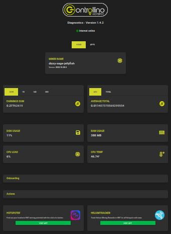

# R.I.P. Controllino

    Update 03/2023 - Controllino firmware has been discontinued and replaced by very limited 
    Nebra firmware which doesn't provide any miner operational details nor logs. So from this date
    all tools published here become unusable and You have to pay for Nebra Diagnostic.
    
[Nebra Ltd providing updates for Controllino/Conelcom Hotspots](https://www.nebra.com/blogs/news/nebra-ltd-providing-updates-for-controllino-conelcom-hotspots)

# Controllino He miner tools

Here are some additional utilities I have implemented and been in active use on my home monitoring
rig running [alpine](https://www.alpinelinux.org/) linux (no systemd ;-). The scripts are mixture of bash and python
programming for quick and easy implementation and fixing to produce the immediate results - high ROI. 

Use at Your own risk - as the [Controllino Hotspot](https://hotspot.controllino.com/) firmware is still under development 
the changes are unexpected and lately also unannounced and there is no backward compatibility maintained or promised:   

    Please note that these utilities are highly firmware version dependent and might 
    stop working on the next firmware update without any warning

### What is Controllino

[Controllino Hotspot](https://hotspot.controllino.com/) is [Raspberry Pi4](https://www.raspberrypi.com/products/raspberry-pi-4-model-b/) 
based LoRaWAN gateway compatible with [Helium network](https://www.helium.com/) and is capable to work as a full [HNT](https://www.helium.com/token) 
crypto miner (now only light mode is supported).

Controllino provides only http accesible Dashboard graphical web interface, but no remote access like ssh or snmp for 
monitoring the running Raspbian OS and included containers:

To get the the full access to Raspbian the physical access to controllino HW is required (brute force to break glued screws) 
and SD card with Raspbian has to be modified. Such jailbreak will unfortunately void the warranty (broken crews) and SD card
mod will be probably lost with the next sw/fw remote upgrade. 

    All published scripts do not require remote ssh / snmp access and work 
    with unmodified / untouched original controllino hardware and software

### Utilities  

Here are some additional utilities I have implemented and been happily using:

* [log viewers](log/) - to retrieve live log entries (console.log or error.log) remotely:

  * [ws_read](log/ws_read.py) - read via websocket ws:// (just proof-of-concept, use ws_tail)
  
  * [ws_tail](log/ws_tail.py) - websocket tail for console log

  * [ws_classify](log/ws_classify.py) - console log classifier, outputs statistics on signal

  * [conf.controllinohotspot](log/conf.controllinohotspot) - config file for [gen.colorizer](https://github.com/garabik/grc)

* [monitors](mon/) - supervising scripts (monitoring and taking action):

  * [monitor-rewards](mon/monitor-rewards.sh) - restart container if rewards are stuck/flat for time period

* [mrtg probes](mrtg/) - to visualize various metrics in famous snmp based [mrtg](https://oss.oetiker.ch/mrtg/) grapher:

  * [HNT rewards](mrtg/mrtg-he-rewards.sh) - mrtg probe to retrieve HNT rewards for time period
  
  * [RAM usage / CPU temperature](mrtg/mrtg-he-ram-temp.sh) - mrtg probe to retrieve RAM utilization and CPU temperature

  * [blockchain height](mrtg/mrtg-he-height.sh) - mrtg probe to retrieve blockchain height - deprecated since fw 1.3.9 (light hotspots)

  * [witnesses overview](mrtg/mrtg-he-witness.sh) - mrtg probe to retrieve General Witnesses statistics   

### Troubleshooting

What to do if something goes wrong or does not work:

* verify validity of values on the controllino dashboard

* try to restart miner container or reboot miner if miner is in suspicious state

* try debug / verbose mode - check usage help how to

* try using explicit parameters (not default ones)

* check the script source and try to increase timeouts, retries etc ...

##### keywords: shell bash python3 websock console.log error.log controllino he helium miner HNT mrtg probe monitoring dashboard

