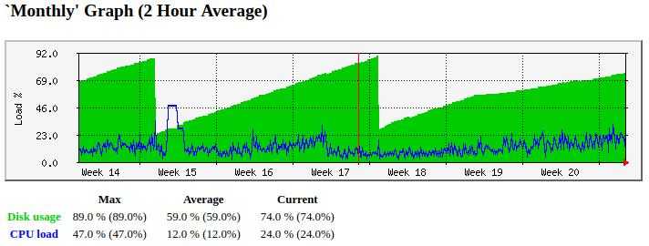

# R.I.P. Controllino

    Update 03/2023 - Controllino firmware has been discontinued and replaced by very limited 
    Nebra firmware which doesn't provide any miner operational details nor logs. So from this date
    all tools published here become unusable and You have to pay for Nebra Diagnostic.
    
[Nebra Ltd providing updates for Controllino/Conelcom Hotspots](https://www.nebra.com/blogs/news/nebra-ltd-providing-updates-for-controllino-conelcom-hotspots)

# mrtg probes for controllinohotspot

[Controllino Hotspot](https://hotspot.controllino.com/) is [Raspberry Pi4](https://www.raspberrypi.com/products/raspberry-pi-4-model-b/) 
based LoRaWAN gateway compatible with [Helium network](https://www.helium.com/).

### Objective

The main objective is to visualy display various [Controllino Hotspot](https://hotspot.controllino.com/) parameters in [mrtg](https://oss.oetiker.ch/mrtg/) grapher
to get quick feedback about health status of the miner. Due to frequent changes in [Helium network](https://www.helium.com/)
it is historical visual comparision the fast way to evaluate required action.

A few interesting facts about Your expensive controllino miner:

* controllino manufacturer has full access to and control of Your home LoRaWAN hotspot/miner

* You have only very limited access to controllino graphical GUI via web interface

* controllino does not support SNMP nor SSH shell access

* openning Your controllino will void Your warranty 

### Requirements

All mrtg probes are shell scripts using:

* bash - script parameters and flow handling

* wget - access to controllino HTTP API

* python3 - for json handling

    All published scripts do not require remote ssh / snmp access and work 
    with unmodified / untouched original controllino hardware and software

### firmware updates warning

The implementation of all mrtg probes is utilizing existing very limited unofficial 
and undocumented controllino HTTP API

    Please note that implemented scripts are highly firmware version dependent and might 
    stop working on the next firmware update without any warning

### mrtg probes - external scripts

Each probe script retrieves data via HTTP API request and formats selecteed values into mrtg
4-line format to be seamlessly processed by mrtg tool. You can find more details in any [mrtg doc](https://oss.oetiker.ch/mrtg/doc/mrtg-reference.en.html):

    External Monitoring Scripts

    If you want to monitor something which does not provide data via snmp you can use some external program to do the data gathering.
    The external command must return 4 lines of output:

    Line 1      current state of the first variable, normally 'incoming bytes count'
    Line 2      current state of the second variable, normally 'outgoing bytes count'
    Line 3      string (in any human readable format), telling the uptime of the target.
    Line 4      string, telling the name of the target.

    Depending on the type of data your script returns you might want to use the 'gauge' or 'absolute' arguments for the Options keyword.
 
Short usage help can be invoked by -h parameter. Detailed debug mode is available with -d parameter.

Here are some controllino probes to visualize various metrics in [mrtg](https://oss.oetiker.ch/mrtg/):

  * [RAM usage / CPU temperature](#mrtg-probe--ram-usage--cpu-temperature) - mrtg probe to retrieve RAM utilization and CPU temperature

  * [HNT rewards](#mrtg-probe--hnt-rewards) - mrtg probe to retrieve HNT rewards for time period
  
  * [blockchain height](#mrtg-probe--blockchain-height) - mrtg probe to retrieve blockchain height (graphs delta) - deprecated since light hotspots

  * [SD card usage and CPU load](#mrtg-probe--disk-usage-and-cpu-load) - mrtg probe to retrieve disk usage and CPU load

  * [Witnesses Overview](@mrtg-probe--witness) - mrtg probe to retrieve General Witnesses statistics

#### mrtg probe - RAM usage / CPU temperature 

Script [mrtg-he-ram-temp.sh](mrtg-he-ram-temp.sh) retrieves RAM usage and CPU temperature
(defined by json keys variable in config section at the top of the script).
Instead of getting used RAM as absolute value we use a formula to calculate RAM usage in percent.
For this we need available RAM for miner container (we assume 4GB defined as HeRAM variable)

Short usage help invoked by -h:

    mrtg$ ./mrtg-he-ram-temp.sh -h
    
    = mrtg probe to graph He miner disk/cpu usage/load = ver 2022.05.12 =
    
    usage: ./mrtg-he-ram-temp.sh [-h] [-d] [host]
    
    -h   ... show this usage help
    -d   ... additional debug info
    host ... host/miner to connect to (default controllinohotspot)
    
    https://github.com/blue-sky-r/controllino-he-tools/blob/main/mrtg/mrtg-he-ram-temp.sh

Example of mrtg monthly graph (wastootk-like RAM usage is related to full miner operation):

#### mrtg probe - HNT Rewards 

Script [mrtg-he-rewards.sh](mrtg-he-rewards.sh) retrieves total and average HNT rewards
(defined by json keys variable in config section at the top of the script).

To get integer values for mrtg the HNT rewards are multiplied by 1000, so the script is actually
returning mili-HNT (mHNT), for  example 500 mHNT = 0.5 HNT. Therefore we have to properly
adujst following mrtg per target factor config options, see [mrtg doc](https://oss.oetiker.ch/mrtg/doc/mrtg-reference.en.html) for details:

    Factor[target]: 0.001
    YTicsFactor[target]: 0.001

Short usage help invoked by -h:

    mrtg$ ./mrtg-he-rewards.sh -h
    
    = mrtg probe to graph He miner rewards = ver 2022.05.15 =
    
    usage: ./mrtg-he-rewards.sh [-h] [-d] [host [days]]
    
    -h   ... show this usage help
    -d   ... additional debug info
    host ... host/miner to connect to (default controllinohotspot)
    days ... reward interval to query in days, valid values are 1,7,14 (default 1)
    
    https://github.com/blue-sky-r/controllino-he-tools/blob/main/mrtg/mrtg-he-rewards.sh

Example of mrtg weekly graph:

#### mrtg probe - blockchain height

Script [mrtg-he-height.sh](mrtg-he-rewards.sh) retrieves blockchain helium_height and miner_height 
(defined by json keys variable in config section at the top of the script). Mrtg graphs
blockchain height delta values (mrtg counter), which are more representative than absolute height values.

Short usage help invoked by -h:

    mrtg$ ./mrtg-he-height.sh -h
    
    = mrtg probe to graph He miner blockchain height = ver 2022.05.08 =
    
    usage: ./mrtg-he-height.sh [-h] [-d] [host]
    
    -h   ... show this usage help
    -d   ... additional debug info
    host ... host/miner to connect to (default controllinohotspot)
    
    https://github.com/blue-sky-r/controllino-he-tools/blob/main/mrtg/mrtg-he-height.sh

Example of mrtg monthly graph:

#### mrtg probe - SD card usage and CPU load

Script [mrtg-he-load.sh](mrtg-he-rewards.sh) retrieves SD card disk usage and CPU load 
(defined by json keys variable in config section at the top of the script). As both values
are in range between 20 to 100 no other processing is required (SD card disk usage is in percent 0-100% and 
CPU temperature is 20C-100C). When SD card is full aroung 90% controllino itself initiate
data cleanup (visible on mrtg graph)

Short usage help invoked by -h:

    mrtg$ ./mrtg-he-load.sh -h
    
    = mrtg probe to graph He miner disk/cpu usage/load = ver 2022.05.10 =
    
    usage: ./mrtg-he-load.sh [-h] [-d] [host]
    
    -h   ... show this usage help
    -d   ... additional debug info
    host ... host/miner to connect to (default controllinohotspot)
    
    https://github.com/blue-sky-r/controllino-he-tools/blob/main/mrtg/mrtg-he-load.sh

Example of mrtg monthly graph (sawtooth-like SD card usage is related to full miner operation):

#### mrtg probe - Wintnesses Overview

Script [mrtg-he-witness.sh](mrtg-he-witness.sh) retrieves Total number of witnesses and Failed witnesses 
from General Witness Overview (efined by json keys variable in config section at the top of the script).
To also process arithmetic expressions with key names it is important to replace spaces in key names with underscores. 
Raw text is retrieved from *miner processlog* and split line-by-line. Absolute values are extracted and
evaluated by key definitions. At midnight 00:00 GMT the values are somehow processed and values drop down
so it gives mrtg graph sawtooth apperance.

Short usage help invoked by -h:

    mrtg$ ./mrtg-he-witness.sh -h

    = mrtg probe to graph He miner General Witnesses Overview = ver 2022.08.83 =
    
    usage: ./mrtg-he-witness.sh [-h] [-d] [host]
    
    -h   ... show this usage help
    -d   ... additional debug info
    host ... host/miner to connect to (default controllinohotspot)
    
    https://github.com/blue-sky-r/controllino-he-tools/blob/main/mrtg/mrtg-he-witness.sh

Example of mrtg weekly graph (witnessing problems are clearly visible as deep drops):

### Troubleshooting

What to do if something goes wrong or does not work:

* try debug / verbose mode - check usage help how to

* try using explicit parameters (not default ones)

* check the script source and try to increase timeouts, retries etc ...

##### keywords: shell bash python3 controllino controllinohotspot RPi4 json he helium miner HNT mrtg probe monitoring

